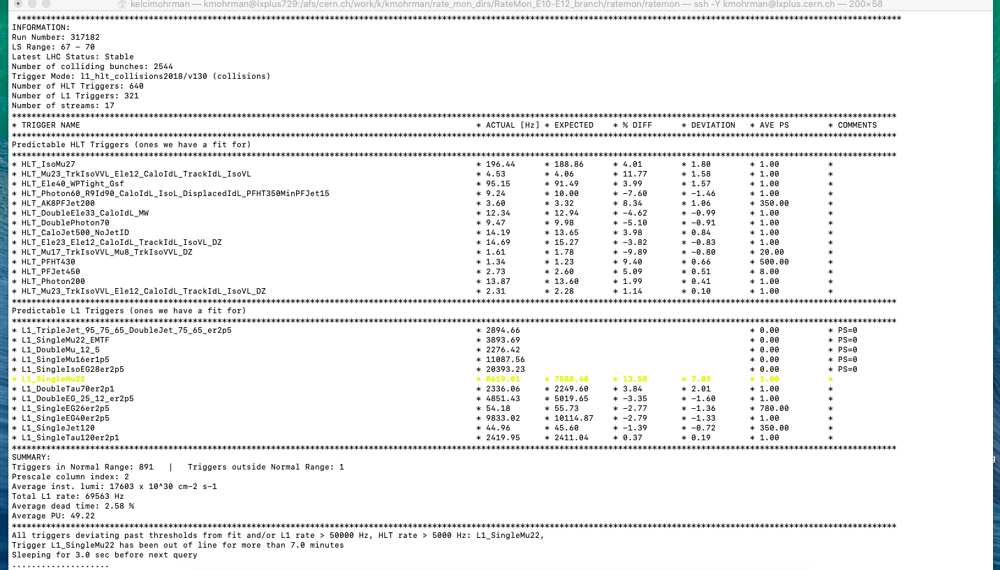

# Introduction to the RateMon tools

This document is designed to be a reference guide for learning how to run the CMS trigger rate monitoring tools (usually referred to as the “RateMon” tools) for new maintainers/developers of the RateMon tools. The code is in a GitLab repository:

- RateMon GitLab repository: https://gitlab.cern.ch/cms-tsg-fog/ratemon

You should be included as a maintainer of this repository, so if you are not currently listed as a maintainer, please ask someone from the RateMon team to add you.

- Current RateMon team: John Lawrence, Kelci Mohrman, Mateusz Zarucki 

## Background 

For background information about the RateMon tools, feel free to take a look through the materials listed below:

- [Poster that summarizes the main components of the RateMon tools](https://indico.cern.ch/event/587955/contributions/2935746/attachments/1683119/2705019/CHEP_poster_v2.pdf) (Presented by Andrew Wightman at the 2018 CHEP conference) 
- [Slides that summarize the RateMon tools](https://indico.cern.ch/event/805157/contributions/3350524/attachments/1815131/2966314/TSGworkshop_RateMon_talk.pdf
) (Presented by Kelci Mohrman at a 2019 TSG workshop)
- [Slides summarizing the RateMon tools more generally, with a brief overview of the CMS trigger system](https://indico.cern.ch/event/782953/contributions/3464896/attachments/1888644/3114119/RateMon_DPFSlides.pdf) (Presented by Kelci Mohrman at the 2019 APS DPF conference)
- [Slides that provide an update on the current state of the tools](https://indico.cern.ch/event/947284/contributions/3995729/attachments/2093836/3518824/Ratemon_Aug31.pdf) (Presented by Antonio Vivace at a L1T meeting in 2020)

- [CMS paper on the trigger system](https://arxiv.org/pdf/1609.02366.pdf)

## Step 0: Preliminary requirements

In order to run the RateMon code, you will need to have an account on `lxplus`. The rest of this document assumes that you are on `lxplus`. To ssh into lxplus, run the following command (switching out “USERNAME” for your `lxplus` username), and enter your password when prompted:  

```bash
ssh -Y USERNAME@lxplus.cern.ch
```

At this point, you will be in your home area (`/afs/cern.ch/user/u/username`, where “u” is the first letter of your username, and “username” is your `lxplus` username). You may run out of space in this area, so it can be easier to work from your work area instead (`/afs/cern.ch/work/u/username`), so you can `cd` into that directory before moving to Step 1. 

```bash
cd /afs/cern.ch/work/u/username
```

## Step 1: Clone the RateMon repository

The RateMon code is located in a GitLab repository. The link to the repository is included at the beginning of this document. To run the code, you will need to copy a version of the code to your area on lxplus using a git clone command. Before cloning the code, feel free to create and `cd` into a directory (e.g. `ratemon_dir`) to keep your area organized. Once you are inside of the directory that you would like the RateMon directory to be located in, run this command:

```bash
git clone https://gitlab.cern.ch/cms-tsg-fog/ratemon.git
```

After running this command, you should have a directory called `ratemon` inside of the directory from which you ran the command. 

## Step 2: database credentials


Now that you have cloned the code, `cd` into the main `ratemon` directory:

```bash
cd ratemon/ratemon/
```

You can do an `ls` to look around at the files in this directory. The two main files that  you will be running are `plotTriggerRates.py` and `ShiftMonitorTool.py`. However, before you are able to run anything, you will need to insert the correct passwords into the file called `dbConfig.yaml`. These will allow the code to access the database to obtain the trigger rate information. Please ask someone from the RateMon team for the passwords, open the file with your favorite text editor (e.g. vim), and enter the passwords in place of the `__cms_hlt_r_pass__` and `__cms_trg_r_pass__` placeholders. 

## Step 3: Running the plotTriggerRates code

In this step, you will learn how to run the `plotTriggerRates.py script`. This script is responsible for making trigger rate vs. pileup plots, and is run offline (as opposed to the `ShiftMonitorTool` script, whose main purpose is to be run online during data taking). The script that you run (`plotTriggerRates.py`) is really just a wrapper for the `RateMonitor.py` script, which in turn uses functions from `DataParser.py` (to obtain the rate information),  `FitFinder.py` (to make fits to the rates), and `PlotMaker.py` (to make the plots). 

### 3.1 Making rate vs. pileup plots

The `plotTriggerRates.py` script can be run with many options to specify how you would like to make the plots  (you can take a look at the `setOptions` function in `plotTriggerRates` to see all of them). However, the only required option is `dbConfigFile`; this is where you specify the yaml file that contains the database passwords. You must also tell the script which run (or runs) to use. Provide this at the end of the command. As an example, you can try to run the following:

```bash
python3 plotTriggerRates.py --dbConfigFile=dbConfig.yaml --triggerList=TriggerLists/monitorlist_COLLISIONS.list 305112
```

The code will now make rate vs. pileup plots for the data in run 305112. You have also specified an additional option (`triggerList`) that tells the code which triggers to make plots for. You can open the file (`TriggerLists/monitorlist_COLLISIONS.list`) to see which triggers these are. The plots will be located in the `tmp_rate_plots/png` directory. There should be a plot for each trigger in the `triggerList` you specified.

You can view the plots by either using the display command (e.g. `display somefile.png`) or by copying the files to somewhere where you can more easily view them (such as your web area, or your laptop). As an example, let’s look at the plot for the “HLT_IsoMu27” trigger:


The x axis is the pileup (number of collisions per bunch crossing), and y axis shows the rate at which the trigger fired. You might notice that the rate is higher at higher pileup, and this makes sense since if you have twice the number of collisions, you might expect that the trigger would be twice as likely to fire. Following this intuition, you can see that the data looks fairly linear. This linear dependence on pileup is however not the case for all triggers, and will be discussed further in the next section.

By default, the code will put the plots into the `tmp_rate_plots` directory every time to run the script, overwriting whatever happened to be in the directory previously. So if you would like to keep the plots, you should move the plots to a different location before running `plotTriggerRates` again, or use the `saveDirectory` option to tell the code where you would like it to put the output plots.

### 3.2: Making fits to the rate vs. pileup plots

The next step is to try to make fits to the rate vs. pileup plots. The code can fit linear, quadratic, and exponential functions to the data. As mentioned in the previous section, we would naively expect the rate for all triggers to have a linear dependence. However it was empirically found that some triggers fit a quadratic or even exponential curve much better than a linear fit. This can be due to detector effects and combinatorics, as some triggers do not scale well with luminosity. Usually, for each trigger, you will want to use the fit that is able to best match the data, so the code is also able to check the mean squared error for each fit, and to select the one with the lowest mean square error. To make rate vs. pileup plots with a fit to the data, you can try running the following command:

```bash
python3 plotTriggerRates.py --dbConfigFile=dbConfig.yaml --createFit --bestFit --triggerList=TriggerLists/monitorlist_COLLISIONS.list 305112
```

This is similar to the command you ran in step 3.1, but with two extra options:

- `--createFit`: This option specifies that the code should generate fits for each plot, the code will automatically make the fits and include the fits in the output plots.

- `--bestFit`: This option tells the code to try and find the best fit from the three fit functions and use the best one based on MSE.

If you look at the output plots, you should see a fit overlaid over each plot. For example, let’s look at the plot for HLT_IsoMu27 again:


In this case, the quadratic function was able to fit the data slightly better than the linear fit. To see what the other fits look like, you can use the `multiFit` option instead of the `bestFit` option:

```bash
python3 plotTriggerRates.py --dbConfigFile=dbConfig.yaml --createFit --multiFit --triggerList=TriggerLists/monitorlist_COLLISIONS.list 305112
```

If you look at the plots that are output by running this command, you should see a linear, quadratic, and exponential fit on each plot.

### 3.3: Overlaying reference fits on rate vs. pileup plots

The ability to make fits to the rate vs. pileup plots is a very important feature of the RateMon code. If you have a reliable fit for the rate as a function of pileup for a given trigger, you will be able to predict what rate you expect for that trigger for any given pileup. The reason why this is important is because it allows you to easily determine if the rate for a particular trigger is diverging from the rate you would expect. During data collection, the online rate monitoring script (`ShiftMonitorTool`) compares the rates of the triggers to the rates predicted by the rate vs. pileup fits, and raises alerts if the rate diverges too much (either high or low) from the expected rate. This can be a very effective way to quickly identify when issues arise during data taking. In this section, you will overlay a fit on top of data from a different run in order to help you visualize these comparisons.

In this section, we will use the fits you made in the previous section as “reference” fits with which to compare data from other runs. Inside of your `tmp_rate_plots` directory, you should have a file called `fit_file.pkl`. This file will contain the fit information for each of the triggers. Since we want to use the best fit as the reference fit, make sure that this file is the file that was created when you ran with the `bestFits` option specified (if the last time you ran `plotTriggerRates.py` you used the `multiFits` option and overwrote your `tmp_rate_plots` directory, just rerun with the `bestFits` option specified). Next, let’s copy this file to the directory from which we run `plotTriggerRates.py`. For example, if you are currently in the same directory as `plotTriggerRates.py`, you can just type the following to copy it:

```bash
cp tmp_rate_plots/fit_file.pkl fit_file.pkl
```

The next step will be to overlay those fits on data from a different run. Since those fits were created from the data from run 305112, for this exercise we will just choose a different run, such as the runs from fill 6749 (which consisted of runs 317291, 317292, 317295, 317296, and 317297). To tell the code to overlay your reference fits, we’ll use the `fitFile` option (and specify the name of the fit file):

```bash
python3 plotTriggerRates.py --dbConfigFile=dbConfig.yaml --triggerList=TriggerLists/monitorlist_COLLISIONS.list --fitFile=fit_file.pkl 317291 317292 317295 317296 317297
```

This should produce plots that contain the data from all of the runs in fill 6749, with the fits from run 305112 overlaid on top of the data. Let’s look at HLT_IsoMu27 again:


There are at least two things worth pointing out about this plot. The first is that the reference fit does not match the data perfectly. The rates of triggers tend to drift over time, so it is important that the reference fits are updated regularly so that they accurately reflect the expected rates. Currently this is handled manually, though developing a more automated procedure is something that the RateMon team may pursue in the future. 

The second thing to notice about this plot is the rates for runs 317295 and 317296 look significantly lower than you would expect. This is exactly the type of issue that the RateMon tools can help to spot. Since this is a muon trigger, you might guess the issue is related to the muon detectors. Indeed, if you check the daily run report from when this data was collected (http://schwick.web.cern.ch/schwick/rctools/dailyReport/detailReport/display/2018-06-02), it turns out that there was partial power loss at the end of run 317292 that resulted in the RPCs being excluded from global running in 317295. The RateMon tools (specifically the ShiftMonitorTool script) can help to quickly identify issues like this by comparing the rates for each trigger to the rates predicted by the trigger’s reference fit, and raising alerts if the rates deviate significantly from the expected rates.

## Step 4: Running the shift monitor tool

In this step, you will try running the `ShiftMonitorTool.py`. As described in the posters and slides linked at the beginning of this document, this part of the code is responsible for comparing the rates of various HLT and L1 triggers to the rates predicted by a set of reference fits. Usually, this script runs continuously at P5 during datataking. As we are currently in the middle of a long shutdown, there is no data being taken. However, we can still run the script in simulate mode, where the script runs over data that was taken during a previous run. Although the script you run is `ShiftMonitorTool.py`, this is really just a wrapper for the main shift monitor script, which is called `ShiftMonitorNCR.py`. Feel free to take a few minutes to open these scripts and look at what they’re doing (though `ShiftMonitorNCR.py` is quite lengthy, and unfortunately not the most well organized script that was ever written, so no need to spend too much time trying to decipher things at this point). 

### 4.1 Setting the RATEMON_LOG_DIR environment variable

The shift monitor code will output log files, and since the code is designed to be run at P5, will by default attempt to output the log files to a directory located on one of the machines at P5 (`/cmsnfshome0/nfshome0/triggershift/RateMonShiftTool/runII_2016/RateMon`). When testing and developing the code, you will be running on `lxplus`, not at P5, so you do not want to output the logs to that directory (and cannot directly access it anyway). To tell the code to output the logs to a different directory, you can set the `RATEMON_LOG_DIR` environment variable (to see why this changes where the code outputs the logs, take a look at lines 9 of Logger.py, and note that if the `RATEMON_LOG_DIR` variable is not set to anything, self.logdir will be set to the default value). Let’s set `RATEMON_LOG_DIR` to your current directory so that the logs will be printed to the directory from which you are running the shift monitor script. First, type pwd to see what your current working directory is. Then run the following command:

```bash
export RATEMON_LOG_DIR=/whatever/your/current/directory/is
```

If you’d like to make sure that it is set to what you think it is, you can run `echo $RATEMON_LOG_DIR` to see what that environment variable is set to. 
4.2 Running the script in simulate mode

Now that your `RATEMON_LOG_DIR` is set to your current directory, you are ready to try running the `ShiftMonitorTool.py`. You will want to run the code with the simulate option, and specify a run for the code to run on (if we were not in the middle of a long shutdown, you could run without the simulate option, and the code would run over the current run, however, even during data taking, the simulate option is still useful for developing and testing the code). Try running the following command: 

```bash
python3 ShiftMonitorTool.py --dbConfigFile=dbConfig.yaml --simulate=317182
```

(Note this will run the new database parser which is new and may cause some bugs. If you encounter errors using this command try the one below to use the old database parser as it may solve your problems)

```bash
python3 ShiftMonitorTool.py --oldParser --dbConfigFile=dbConfig.yaml --simulate=317182
```

After running this command, the code will start to run over the run you specified. Eventually (the code can sometimes take a while to run), sou should see some output that looks like this:



In this example, you can see that the rates of the trigger L1_SingleMu22 are deviating from the expected rates, so the trigger is highlighted in yellow. If this trigger continues to deviate for multiple consecutive lumisections, it will be flagged and (if the script were being run at P5 in real time during data taking) would trigger an alert email to the FOG group (but running offline and in simulate mode, all alerts and alarms should be disabled, so you do not need to worry about accidentally triggering any alert emails!). 

If you continue to let the script run, it should continue to run through the entirety of run 317182, but after looking at a few of the printouts for a few of the lumisections, feel free to kill the script with `Control+C` (i.e. pressing the “C” key while holding down the “control” or “Ctrl” key). 

